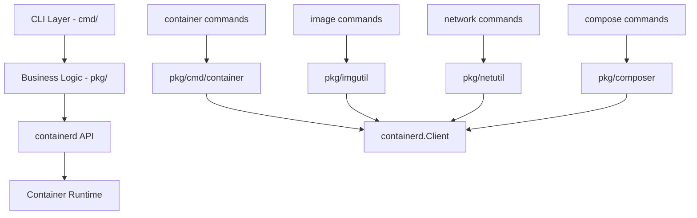

# nerdctl 项目架构深度分析

## 1. 项目整体架构概述

### 1.1 项目定位

nerdctl 是 containerd 的 **Docker 兼容 CLI 工具**，其核心设计理念：

```
User Commands → nerdctl CLI → containerd API → Container Runtime
```

**架构特点：**
- 🎯 **Docker 兼容性**：提供与 Docker CLI 完全相同的用户体验
- 🔧 **containerd 集成**：直接使用 containerd 作为底层容器运行时
- 🚀 **扩展功能**：支持 Docker 不具备的特性（rootless、P2P 镜像分发等）
- 📦 **模块化设计**：清晰的分层架构便于维护和扩展

### 1.2 技术栈

- **核心语言**: Go 1.23+
- **CLI 框架**: Cobra (spf13/cobra)
- **容器运行时**: containerd v2.x
- **网络管理**: CNI (Container Network Interface)
- **构建系统**: BuildKit 集成
- **编排支持**: Docker Compose 兼容

## 2. 核心模块架构

### 2.1 目录结构分析

```
nerdctl/
├── cmd/nerdctl/           # CLI 命令层
│   ├── main.go           # 主入口和全局设置
│   ├── container/        # 容器管理命令
│   ├── image/            # 镜像管理命令  
│   ├── network/          # 网络管理命令
│   ├── volume/           # 存储卷管理命令
│   ├── compose/          # Docker Compose 支持
│   ├── builder/          # 镜像构建命令
│   └── system/           # 系统管理命令
├── pkg/                   # 核心业务逻辑包
│   ├── api/types/        # API 类型定义
│   ├── clientutil/       # containerd 客户端工具
│   ├── cmd/              # 命令实现逻辑
│   ├── netutil/          # 网络管理工具
│   ├── imgutil/          # 镜像管理工具
│   ├── composer/         # Compose 编排逻辑
│   ├── containerutil/    # 容器管理工具
│   └── ...              # 其他工具包
├── mod/tigron/           # 测试框架
└── examples/             # 使用示例
```

### 2.2 分层架构设计



## 3. 命令行架构设计

### 3.1 基于 Cobra 的命令架构

nerdctl 使用 Cobra 框架构建命令行界面，实现了模块化的命令组织：

```go
// main.go - 根命令定义
var rootCmd = &cobra.Command{
    Use:              "nerdctl",
    Short:            "nerdctl is a command line interface for containerd",
    TraverseChildren: true, // 支持全局参数继承
}

rootCmd.AddCommand(
    container.CreateCommand(),     // nerdctl create
    container.RunCommand(),        // nerdctl run
    image.PullCommand(),          // nerdctl pull
    image.BuildCommand(),         // nerdctl build
    network.CreateCommand(),      // nerdctl network create
    compose.Command(),            // nerdctl compose
    // ... 更多命令
)
```

### 3.2 命令分类体系

**Management Commands (管理命令):**
- `container` - 容器生命周期管理
- `image` - 镜像生命周期管理
- `network` - 网络管理
- `volume` - 存储卷管理
- `system` - 系统信息和清理

**Direct Commands (直接命令):**
- `run/create/start/stop` - 容器操作
- `pull/push/build` - 镜像操作
- `compose` - 编排操作

### 3.3 全局配置管理

```go
// pkg/config/config.go - 全局配置结构
type Config struct {
    Namespace      string // containerd 命名空间
    Address        string // containerd socket 地址
    DataRoot       string // 数据根目录
    CgroupManager  string // cgroup 管理器
    SnapShotter    string // 存储驱动
    // ... 更多全局配置
}
```

## 4. containerd 集成机制

### 4.1 客户端连接层

```go
// pkg/clientutil/client.go - 核心客户端创建逻辑
func NewClient(ctx context.Context, namespace, address string, opts ...containerd.Opt) (*containerd.Client, context.Context, context.CancelFunc, error) {
    ctx = namespaces.WithNamespace(ctx, namespace)
    
    // 检查 socket 可访问性
    if err := systemutil.IsSocketAccessible(address); err != nil {
        return nil, nil, nil, fmt.Errorf("cannot access containerd socket %q: %w", address, err)
    }
    
    client, err := containerd.New(address, opts...)
    if err != nil {
        return nil, nil, nil, err
    }
    
    ctx, cancel := context.WithCancel(ctx)
    return client, ctx, cancel, nil
}
```

### 4.2 命名空间管理

nerdctl 通过 containerd 的命名空间机制实现资源隔离：

- **默认命名空间**: `nerdctl` 
- **Kubernetes 支持**: `k8s.io` 命名空间
- **自定义命名空间**: 通过 `--namespace` 参数指定

### 4.3 镜像管理集成

```go
// pkg/imgutil/imgutil.go - 镜像确保机制
func EnsureImage(ctx context.Context, client *containerd.Client, stdout, stderr io.Writer, snapshotter, rawRef string, pullMode string, options ...imgutil.EnsureImageOpt) (*containerd.Image, error) {
    ref, err := referenceutil.ParseDockerRef(rawRef)
    if err != nil {
        return nil, err
    }
    
    // 检查本地镜像
    if pullMode != "always" {
        if image, err := client.GetImage(ctx, ref.String()); err == nil {
            return image, nil
        }
    }
    
    // 拉取远程镜像
    return pullImage(ctx, client, stdout, stderr, snapshotter, ref, options...)
}
```

## 5. 网络架构设计

### 5.1 CNI 集成架构

nerdctl 通过 CNI (Container Network Interface) 标准实现网络管理：

```go
// pkg/netutil/netutil.go - CNI 配置管理
type CNIEnv struct {
    Path        string // CNI 插件路径
    NetconfPath string // 网络配置路径
    Namespace   string // 网络命名空间
}

func (e *CNIEnv) ListNetworks() ([]*NetworkConfig, error) {
    return fsRead(e) // 从文件系统读取网络配置
}
```

### 5.2 网络模式支持

- **bridge 模式**: 默认桥接网络（类似 docker0）
- **host 模式**: 共享主机网络栈
- **none 模式**: 无网络配置
- **自定义网络**: 支持用户定义网络

### 5.3 网络配置存储

```go
type NetworkConfig struct {
    Name        string                 `json:"name"`
    CNIVersion  string                 `json:"cniVersion"`  
    Type        string                 `json:"type"`
    Master      string                 `json:"master,omitempty"`
    NerdctlID   *string                `json:"nerdctlID,omitempty"`
    NerdctlName *string                `json:"nerdctlName,omitempty"`
    // ... 其他配置字段
}
```

## 6. 存储架构设计

### 6.1 卷管理架构

```go
// pkg/mountutil/volumestore/volumestore.go
type VolumeStore interface {
    Create(name string, labels map[string]string) (*volume.Volume, error)
    Get(name string, size bool) (*volume.Volume, error)  
    List(filters map[string]string) ([]*volume.Volume, error)
    Remove(names []string) error
}
```

### 6.2 数据持久化

- **卷数据目录**: `${DATA_ROOT}/volumes/`  
- **元数据存储**: JSON 格式存储卷元信息
- **挂载点管理**: 支持 bind mount 和 volume mount

### 6.3 快照管理器集成

nerdctl 支持多种 containerd snapshotter：

- **overlayfs**: 默认存储驱动（Linux）
- **native**: 原生存储驱动 
- **stargz**: 惰性拉取镜像支持
- **nydus**: P2P 镜像分发支持

## 7. Docker Compose 兼容架构

### 7.1 Compose 解析引擎

```go
// pkg/composer/composer.go - Compose 编排核心
type Composer struct {
    Options Options
    project *compose.Project  // compose-spec 项目对象
    client  *containerd.Client
}

func (c *Composer) Services(ctx context.Context, svcs ...string) ([]*serviceparser.Service, error) {
    // 解析并返回服务定义
    return parseServices(c.project, svcs...)
}
```

### 7.2 服务编排流程

1. **配置解析**: 解析 `docker-compose.yaml`
2. **依赖分析**: 构建服务依赖图  
3. **网络创建**: 创建项目网络
4. **卷创建**: 创建持久化存储卷
5. **服务启动**: 按依赖顺序启动容器
6. **健康检查**: 监控服务状态

### 7.3 Compose 命令支持

- `nerdctl compose up` - 启动服务栈
- `nerdctl compose down` - 停止并清理服务栈  
- `nerdctl compose ps` - 显示服务状态
- `nerdctl compose logs` - 查看服务日志
- `nerdctl compose build` - 构建服务镜像

## 8. 高级特性架构

### 8.1 Rootless 模式

支持非 root 用户运行容器：

```
User Process → RootlessKit → Rootless containerd → Container
```

**关键组件:**
- **RootlessKit**: 提供用户命名空间隔离
- **slirp4netns**: 用户态网络栈
- **bypass4netns**: 优化网络性能

### 8.2 P2P 镜像分发 (IPFS)

```go
// pkg/ipfs/registry.go - IPFS 集成
func EnsureImage(ctx context.Context, client *containerd.Client, imgName, ipfsAddr string) error {
    // 通过 IPFS 网络拉取镜像
    return ipfsPullImage(ctx, client, imgName, ipfsAddr)
}
```

### 8.3 镜像签名验证

- **cosign 集成**: 支持镜像签名验证
- **notation 集成**: 支持 CNCF Notary v2 标准
- **策略配置**: 灵活的签名策略管理

## 9. 测试架构 - Tigron 框架

### 9.1 测试框架设计

Tigron 是 nerdctl 专用的集成测试框架：

```
Test Specification → Tigron Engine → nerdctl Binary → Test Result
```

### 9.2 测试能力

- **命令行测试**: 模拟各种 nerdctl 命令场景
- **并发测试**: 支持多容器并发操作测试
- **环境隔离**: 独立的测试环境管理
- **结果验证**: 丰富的断言和验证机制

## 10. 性能优化架构

### 10.1 镜像优化

- **并行拉取**: 支持镜像层并行下载
- **增量更新**: 基于内容寻址的增量同步  
- **压缩算法**: 支持 gzip、zstd 等压缩算法
- **惰性加载**: stargz/nydus 惰性镜像支持

### 10.2 网络优化

- **bypass4netns**: rootless 模式网络加速
- **CNI 缓存**: 网络配置缓存机制
- **连接复用**: containerd 连接池管理

## 11. 扩展性设计

### 11.1 插件架构

- **CNI 插件**: 可扩展的网络插件系统
- **snapshotter**: 可插拔的存储驱动
- **runtime**: 支持多种 OCI 运行时

### 11.2 配置可扩展性  

- **TOML 配置**: 灵活的配置文件格式
- **环境变量**: 运行时配置覆盖
- **命令行参数**: 临时配置调整

## 12. 总结

nerdctl 通过精心设计的分层架构，成功实现了：

✅ **完整的 Docker 兼容性** - 用户无缝迁移  
✅ **现代化的技术栈** - 基于 containerd 和 Go 生态  
✅ **丰富的扩展特性** - 支持最新的容器技术趋势  
✅ **高度模块化设计** - 便于维护和功能扩展  
✅ **生产环境就绪** - 企业级的可靠性和性能  

这种架构设计使 nerdctl 不仅是一个简单的 CLI 替代品，更是一个面向未来的容器管理平台的基础。