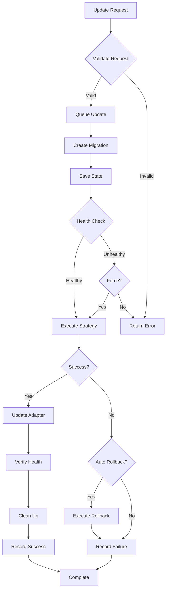

# nerdctl gRPC Server Upgrade System

This document describes the comprehensive upgrade and hot update system for the nerdctl gRPC server, providing zero-downtime version transitions and robust rollback capabilities.

## Table of Contents

- [Overview](#overview)
- [Architecture](#architecture)
- [Upgrade Strategies](#upgrade-strategies)
- [Hot Update Process](#hot-update-process)
- [API Reference](#api-reference)
- [Configuration](#configuration)
- [Monitoring & Health Checks](#monitoring--health-checks)
- [Rollback System](#rollback-system)
- [Best Practices](#best-practices)

## Overview

The upgrade system provides:

- **Zero-Downtime Updates**: Hot swap adapters without service interruption
- **Multiple Strategies**: Immediate, graceful, and scheduled upgrade approaches
- **Automatic Rollback**: Recovery from failed upgrades
- **Health Monitoring**: Continuous system health validation
- **Version Management**: Support for multiple nerdctl versions
- **Persistent State**: Recovery from system restarts

### Key Components

```
┌─────────────────────────────────────────────────────────────┐
│                    Upgrade System                           │
├─────────────────────────────────────────────────────────────┤
│ HotUpdateService                                            │
│ ├── Update Request Queue                                    │
│ ├── Health Monitoring                                       │
│ ├── Adapter Generation Tracking                            │
│ └── Update History                                          │
├─────────────────────────────────────────────────────────────┤
│ UpgradeManager                                              │
│ ├── Monitoring Loop                                         │
│ ├── Migration Queue                                         │
│ ├── Version Detection                                       │
│ └── Rollback Management                                     │
├─────────────────────────────────────────────────────────────┤
│ Migration System                                            │
│ ├── Strategy Registry                                       │
│ ├── Migration Persistence                                   │
│ ├── Validation Engine                                       │
│ └── Rollback Data Management                               │
└─────────────────────────────────────────────────────────────┘
```

## Architecture

### Core Components

#### 1. HotUpdateService

The central coordinator for hot updates:

```go
type HotUpdateService struct {
    manager            *UpgradeManager
    migrationRegistry  *MigrationRegistry
    persistence        *MigrationPersistence
    config             *config.Config
    
    // Current state
    currentAdapter     atomic.Value
    adapterGeneration  int64
    
    // Update coordination
    updateMutex        sync.RWMutex
    pendingUpdate      *PendingUpdate
    updateQueue        chan *UpdateRequest
}
```

**Key Features:**
- Thread-safe adapter management
- Atomic adapter swapping
- Generation tracking for consistency
- Request queuing and processing

#### 2. UpgradeManager

Handles automatic upgrade detection and management:

```go
type UpgradeManager struct {
    factory         *factory.AdapterFactory
    detector        compatibility.Detector
    config          *config.Config
    currentAdapter  interfaces.Adapter
    upgradePolicy   *UpgradePolicy
    migrationQueue  chan *MigrationTask
}
```

**Responsibilities:**
- Version monitoring
- Automatic upgrade triggers
- Policy enforcement
- Migration task coordination

#### 3. Migration System

Implements different upgrade strategies:

```go
type MigrationStrategy interface {
    Execute(ctx context.Context, migration *Migration) error
    Validate(migration *Migration) error
    Rollback(ctx context.Context, migration *Migration) error
}
```

**Available Strategies:**
- `ImmediateMigrationStrategy`: Hot swap without delay
- `GracefulMigrationStrategy`: Wait for opportune moments
- `ScheduledMigrationStrategy`: Execute at specific times

## Upgrade Strategies

### 1. Immediate Strategy

**Use Case**: Production systems requiring instant updates
**Downtime**: Zero
**Risk**: Medium

```go
// Configuration
{
    "strategy": "immediate",
    "force": false
}
```

**Process:**
1. Create new adapter with target version
2. Verify adapter functionality
3. Atomic swap with current adapter
4. Cleanup old adapter resources

**Best For:**
- Critical security updates
- Bug fixes
- Non-breaking changes

### 2. Graceful Strategy

**Use Case**: Systems with predictable load patterns
**Downtime**: Near-zero
**Risk**: Low

```go
// Configuration
{
    "strategy": "graceful",
    "graceful_timeout": 30,
    "health_check_func": customHealthCheck
}
```

**Process:**
1. Monitor system health and load
2. Wait for low-activity period
3. Drain existing connections
4. Perform adapter swap
5. Verify new adapter health

**Best For:**
- Major version upgrades
- Breaking changes
- Production environments with SLA requirements

### 3. Scheduled Strategy

**Use Case**: Maintenance windows and planned upgrades
**Downtime**: Minimal
**Risk**: Low

```go
// Configuration
{
    "strategy": "scheduled",
    "scheduled_time": "2024-12-01T02:00:00Z"
}
```

**Process:**
1. Queue upgrade for specified time
2. Execute at scheduled time
3. Monitor and validate
4. Report completion status

**Best For:**
- Major architectural changes
- Database migrations
- Coordinated deployments

## Hot Update Process

### Update Lifecycle



### Request Processing

1. **Validation**: Check request parameters and system state
2. **Queuing**: Add to update queue for sequential processing
3. **Migration Creation**: Build migration object with metadata
4. **State Persistence**: Save migration state for recovery
5. **Health Verification**: Ensure system is ready for update
6. **Strategy Execution**: Run selected migration strategy
7. **Adapter Update**: Atomic swap to new adapter
8. **Post-Update Health Check**: Verify new adapter functionality
9. **Cleanup**: Remove old resources and temporary state

### Error Handling

The system provides comprehensive error handling:

```go
type UpdateResponse struct {
    Success   bool
    UpdateID  string
    Error     error
    Metadata  map[string]interface{}
}
```

**Error Recovery:**
- Automatic rollback on failure (configurable)
- State persistence for crash recovery
- Detailed error reporting
- Health check integration

## API Reference

### gRPC Service Interface

```protobuf
service UpgradeService {
  rpc GetVersionInfo(GetVersionInfoRequest) returns (GetVersionInfoResponse);
  rpc CheckForUpdates(CheckForUpdatesRequest) returns (CheckForUpdatesResponse);
  rpc TriggerUpgrade(TriggerUpgradeRequest) returns (TriggerUpgradeResponse);
  rpc GetUpgradeStatus(GetUpgradeStatusRequest) returns (GetUpgradeStatusResponse);
  rpc RollbackUpgrade(RollbackUpgradeRequest) returns (RollbackUpgradeResponse);
  rpc WatchUpgradeStatus(WatchUpgradeStatusRequest) returns (stream UpgradeStatusEvent);
}
```

### Key API Operations

#### Trigger Upgrade

```bash
# Immediate upgrade
grpcurl -d '{
  "target_version": "2.1.0",
  "strategy": "immediate",
  "force": false,
  "dry_run": false
}' localhost:9000 nerdctl.upgrade.UpgradeService/TriggerUpgrade

# Graceful upgrade with timeout
grpcurl -d '{
  "target_version": "2.1.0",
  "strategy": "graceful",
  "graceful_timeout_seconds": 60
}' localhost:9000 nerdctl.upgrade.UpgradeService/TriggerUpgrade

# Scheduled upgrade
grpcurl -d '{
  "target_version": "2.1.0",
  "strategy": "scheduled",
  "scheduled_time": "2024-12-01T02:00:00Z"
}' localhost:9000 nerdctl.upgrade.UpgradeService/TriggerUpgrade
```

#### Monitor Status

```bash
# Get current status
grpcurl localhost:9000 nerdctl.upgrade.UpgradeService/GetUpgradeStatus

# Watch status stream
grpcurl -d '{"include_heartbeat": true}' localhost:9000 nerdctl.upgrade.UpgradeService/WatchUpgradeStatus
```

#### Rollback

```bash
# Rollback to previous version
grpcurl -d '{"force": false}' localhost:9000 nerdctl.upgrade.UpgradeService/RollbackUpgrade
```

## Configuration

### Upgrade Policy

```yaml
# config.yaml
upgrade:
  auto_upgrade: true
  check_interval: 5m
  upgrade_strategy: "graceful"
  graceful_timeout: 30s
  rollback_on_failure: true
  
  version_constraints:
    min_version: "1.7.0"
    max_version: "2.x.x"
    exclude_versions: ["2.0.1", "2.0.2"]
  
  allowed_hours:
    - "02:00-04:00"
    - "14:00-16:00"
  
  blocked_days:
    - "friday"
    - "saturday"
```

### Environment Variables

```bash
# Enable auto-upgrades
export NERDCTL_AUTO_UPGRADE=true

# Set upgrade strategy
export NERDCTL_UPGRADE_STRATEGY=graceful

# Configure check interval
export NERDCTL_UPGRADE_CHECK_INTERVAL=300s

# Enable rollback on failure
export NERDCTL_ROLLBACK_ON_FAILURE=true

# Set state directory
export NERDCTL_STATE_DIR=/var/lib/nerdctl-grpc/state
```

## Monitoring & Health Checks

### Health Checker Interface

```go
type HealthChecker interface {
    CheckHealth(ctx context.Context) error
    IsHealthy() bool
    GetHealthStatus() map[string]interface{}
}
```

### Default Health Checks

The system performs several health checks:

1. **Adapter Availability**: Verify adapter is not nil
2. **Basic Functionality**: Test container listing
3. **Command Execution**: Verify nerdctl command works
4. **Resource Availability**: Check system resources

### Custom Health Checks

Implement custom health checking:

```go
type CustomHealthChecker struct {
    adapter interfaces.Adapter
    checks  []HealthCheck
}

func (c *CustomHealthChecker) CheckHealth(ctx context.Context) error {
    for _, check := range c.checks {
        if err := check.Execute(ctx, c.adapter); err != nil {
            return fmt.Errorf("health check %s failed: %w", check.Name(), err)
        }
    }
    return nil
}
```

### Monitoring Integration

The upgrade system exposes metrics:

```go
type UpgradeMetrics struct {
    TotalUpgrades      int64
    SuccessfulUpgrades int64
    FailedUpgrades     int64
    Rollbacks          int64
    AverageUpgradeTime float64
    UptimePercentage   float64
}
```

## Rollback System

### Automatic Rollback

Configured via policy:

```go
type UpgradePolicy struct {
    RollbackOnFailure bool
    RollbackTimeout   time.Duration
    HealthCheckRetries int
}
```

### Manual Rollback

Trigger rollback via API:

```bash
# Rollback to previous version
grpcurl -d '{
  "force": false
}' localhost:9000 nerdctl.upgrade.UpgradeService/RollbackUpgrade
```

### Rollback Data

The system maintains rollback information:

```go
type RollbackData struct {
    PreviousConfig   *config.Config
    PreviousBinary   string
    AdapterState     map[string]interface{}
    BackupTimestamp  time.Time
}
```

## Best Practices

### 1. Pre-Upgrade Validation

Always validate before upgrading:

```bash
# Dry run to test upgrade
grpcurl -d '{
  "target_version": "2.1.0",
  "strategy": "immediate",
  "dry_run": true
}' localhost:9000 nerdctl.upgrade.UpgradeService/TriggerUpgrade
```

### 2. Health Check Configuration

Implement comprehensive health checks:

```go
healthChecker := &CustomHealthChecker{
    checks: []HealthCheck{
        &ContainerListCheck{},
        &ImagePullCheck{},
        &NetworkConnectivityCheck{},
        &VolumeAccessCheck{},
    },
}
```

### 3. Monitoring Setup

Monitor upgrade metrics:

```go
// Prometheus metrics example
upgradeCounter := prometheus.NewCounterVec(
    prometheus.CounterOpts{
        Name: "nerdctl_upgrades_total",
        Help: "Total number of upgrades performed",
    },
    []string{"strategy", "result"},
)
```

### 4. Backup Strategy

Maintain backups before upgrades:

```bash
# Backup current state
kubectl create configmap nerdctl-backup \
  --from-file=config=/etc/nerdctl/config.yaml \
  --from-file=state=/var/lib/nerdctl-grpc/state/
```

### 5. Testing Strategy

Test upgrades in staging:

```yaml
# staging-upgrade-test.yaml
apiVersion: v1
kind: ConfigMap
metadata:
  name: upgrade-test-config
data:
  config.yaml: |
    upgrade:
      auto_upgrade: false
      test_mode: true
      upgrade_strategy: "immediate"
```

### 6. Rollback Planning

Always have a rollback plan:

```bash
#!/bin/bash
# rollback-script.sh

# Check system health
if ! grpcurl localhost:9000 nerdctl.upgrade.UpgradeService/GetUpgradeStatus | jq -r '.is_healthy'; then
  echo "System unhealthy, initiating rollback"
  grpcurl -d '{"force": true}' localhost:9000 nerdctl.upgrade.UpgradeService/RollbackUpgrade
fi
```

## Troubleshooting

### Common Issues

1. **Upgrade Stuck**: Check logs for migration strategy issues
2. **Health Check Failures**: Verify nerdctl binary accessibility
3. **Rollback Failures**: Check rollback data integrity
4. **State Corruption**: Restore from backup

### Debug Commands

```bash
# Check upgrade status
grpcurl localhost:9000 nerdctl.upgrade.UpgradeService/GetUpgradeStatus

# Get upgrade history
grpcurl localhost:9000 nerdctl.upgrade.UpgradeService/GetUpgradeHistory

# Validate upgrade path
grpcurl -d '{
  "from_version": "2.0.0",
  "to_version": "2.1.0",
  "strategy": "immediate"
}' localhost:9000 nerdctl.upgrade.UpgradeService/ValidateUpgrade
```

### Log Analysis

Monitor upgrade logs:

```bash
# Filter upgrade-related logs
journalctl -u nerdctl-grpc-server | grep -i upgrade

# Watch upgrade events
tail -f /var/log/nerdctl-grpc-server.log | grep -i migration
```

## Security Considerations

1. **Access Control**: Limit upgrade API access
2. **Binary Verification**: Validate nerdctl binary signatures
3. **State Encryption**: Encrypt sensitive rollback data
4. **Audit Logging**: Log all upgrade operations
5. **Network Security**: Secure upgrade status streams

## Future Enhancements

- **Canary Deployments**: Gradual traffic shifting
- **Blue-Green Deployments**: Parallel version deployment
- **Multi-Region Upgrades**: Coordinated global upgrades
- **A/B Testing**: Version comparison testing
- **Automated Testing**: Post-upgrade validation
- **Machine Learning**: Predictive upgrade timing

---

For more information, see:
- [Configuration Guide](./CONFIGURATION.md)
- [API Documentation](./API.md)
- [Testing Guide](../test/README.md)
- [Troubleshooting Guide](./TROUBLESHOOTING.md)